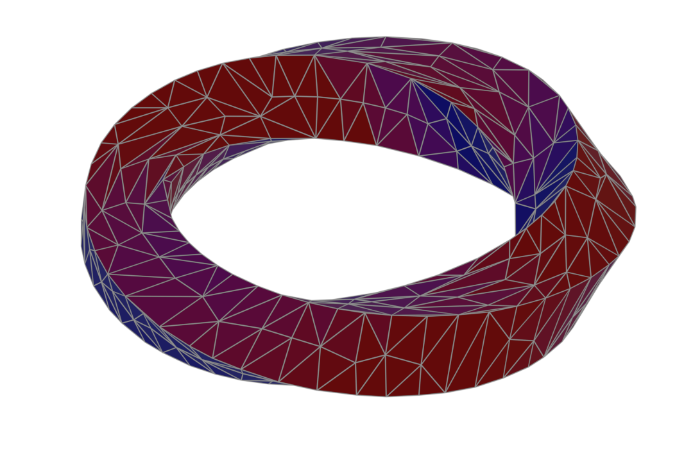

# Appunti di Matematica 


https://allibis.github.io/Appunti-di-Matematica/

## 💭 Parte 1: L'idea di partenza
Questo è un esperimento personale nato come soluzione alternativa alla rielaborazione "classica" degli appunti universitari. 

Ogni definizione, teorema, proposizione e così via sono stati scritti in maniera "atomica" seguendo la filosofia dello [zettelkasten](https://www.goodnotes.com/blog/zettelkasten-method)

Poi, per poter mettere in ordine le informazioni e poterle rivedere in maniera sequenziale, le ho inserite tutte in un singolo file suddividendole in capitoli e paragrafi. 

La prima materia usata come "cavia" è stata Topologia Generale che, come per ogni ramo della matematica, forma un fitto reticolo di informazioni interconnesse, tra definizioni, teoremi e proposizioni. 

## 🧬Parte 2: L'evoluzione

Ad un certo punto, navigando tra le documentazioni di Obsidian per personalizzare al meglio le mie note e cercare plugin utili, mi sono imbattuto in [Quartz](https://quartz.jzhao.xyz/). A quel punto ho deciso di fare un tentativo per trasformare le note in un sito web consultabile da chiunque. 

A quel punto l'idea di trasformare l'esperienza dello studio in un'attività doppiamente produttiva ha trovato un medium ancora più potente, che mette insieme la mia carriera accademica e la mia passione per l'informatica

## 🖥️Parte 3: crisi informatiche

Quartz è una piattaforma che funziona benissimo out-of-the-box, ma la sua potenza è la possibilità totalizzante di configurare a proprio piacimento ogni minimo aspetto.

A quel punto si è attivato il mio perfezionismo, che non ha fatto i conti con le mie inesistenti conoscenze di TypeScript, il linguaggio principale usato da Quartz.

Ammetto che in questa avventura DeepWiki e Gemini sono stati ottimi strumenti in grado di aiutarmi a dare forma alle personalizzazioni che avevo in mente (del resto non avevo il tempo di imparare da 0 un nuovo linguaggio appositamente).

Tra mille tentativi di far funzionare le modifiche che avevo in mente per cambiare il modo in cui il grafico dei nodi (quello in alto a destra del sito) in modo tale da escludere selettivamente delle pagine (cosa mancante in quartz "vanilla"), tweak vari di parametri e impostazioni scss, un bug del generatore dei file html (per colpa degli alias salvava la pagina creata a partire da  Topologia.md a topologia.html e Github Pages è troppo case sensitive quindi non collegava bene i link interni), c'erano momenti in cui bramavo ardentemente una bacchetta magica. 

Però quartz è stato un ottimo pretesto per rimanere concentrato sul mio obiettivo: completare tutti gli appunti e andare preparato all'esame

## Setup Finale
Adesso che ho provato un po' di strumenti (gratuiti e possibilmente open source), ho trovato la mia squadra Avengers che mi permette di creare un risultato soddisfacente:
- Plugin di Obsidian: 
    - Latex Suit: implementa una preview contestuale della formula latex e la possibilità di impostare shortcut, oltre a quelle preimpostate dal plugin, facilmente nel menu stesso di obsidian
    - Dataview e Heatmap Tracker: utilizzate nella dashboard per avere una traccia di quanto lavoro ho svolto e qualche statistica (assolutamente inutile ma figo da vedere)
    - Excalidraw: utilizzato ampiamente per creare diagrammi carini e facili, abbandonato perché non mi trovavo bene a disegnare le curve  (per intenderci le curve non seguivano i punti di controllo secondo una normale curva di bezier) ed è un po' scomodo per inserire delle espressioni in latex. Abbandonato dopo aver iniziato a usare Quartz dato che cercavo qualcosa di più flessibile e più vicino a latex per creare diagrammi.
- [Mathcha.io](https://www.mathcha.io): è come usare word, ma con latex integrato. 
    L'ho iniziato ad usare per prendere appunti durante la lezione, comodissimo, configurabile e pieno di funzionalità, tra cui quella di creare disegni e grafici come se fosse un normalissimo editor svg, ma costruito sul pacchetto tikz. Questo sito permette di creare svg nel giro di minuti, con espressioni latex, curve di bezier come si deve, grafici sia 2d che 3d ecc...
- [KLaTeXFormula](https://klatexformula.sourceforge.io/): Scoperto perché cercavo una precisione che nemmeno una funzionalità "snap to grid" può darmi. 
    Programma standalone che permette di creare dei diagrammi tikz scritti direttamente in latex e salvarli in mille formati differenti (nel mio caso svg). Altamente configurabile e ovviamente open source. 

## Cosa ho cambiato di Quartz

- ### Risolto un problema con gli alias
    Ho rimosso totalmente una parte che processa gli aliases nel file [`frontmatter.ts`](https://github.com/allibis/Appunti-di-Matematica/blob/e084c16f6a3e6dfda990524c45a27c58c62853f3/quartz/plugins/transformers/frontmatter.ts), in particolare la sezione:
    ```
    const aliases = coerceToArray(coalesceAliases(data, ["aliases", "alias"]))
    if (aliases) {
    data.aliases = aliases // frontmatter
    file.data.aliases = getAliasSlugs(aliases)
    allSlugs.push(...file.data.aliases)
    }
    ```
    Questo perché ho notato che, a differenza della build locale con `npx quartz build --serve`, su github pages molti link erano rotti.
  
  Ho notato che durante la generazione dei file html, quartz crea delle pagine di "rimbalzo" create per quando nel file markdown ci sono proprietà `aliases`.
  
    Per comodità (prima ancora di usare quartz) io imposto la nota obsidian così:
  
    Topologia.md
    ```
    ---
    tags: [Topologia, Definizioni]
    aliases: [topologia, topologie, spazio tologico]
    ---
    > [!def] Topologia
    ...
    ```

    Quartz vede nella nota gli alias e crea i file `topologia.html`, `topologie.html`, `spazio-topologico.html` contenenti un redirect alla pagina `Topologia.html`
  
    Se non fosse che, per qualche strana ragione, invece di avere un file `Topologia.html` con il vero contenuto e uno distinto `topologia.html` con il redirect, nella build finale trovavo un singolo file `topologia.html` con tutto il contenuto.
  
    La mia ipotesi è che il file originale viene in qualche modo salvato prima con la T maiuscola e poi viene rinominato.
  
    Le possibilità a cui ho pensato erano due: rimuovere tutti gli alias da ogni singola nota, o disabilitare il codice che legge gli alias. La seconda era quella più veloce da mettere in pratica e con mia grande gioia non rompeva nessun link, nemmeno quelli del tipo `[[Topologia|topologia]]`.


- ### Generazione del grafico 
    Dal momento che il mio metodo è quello di scrivere tante note scritte singolarmente e poi riordinarle in un unica pagina mediante embeds `![[Nota]]`, nel grafico appariva il nodo di quest'ultima collegata a tutto il resto, creando un ammasso inutile di connessioni tra nodi.
  
    Per questo ho cercato un modo di eliminare selettivamente determinati nodi dalla creazione finale del grafico. 
    L'unica soluzione era quella di modificare la logica interna al codice, ossia nei file [`graph.inline.ts`](https://github.com/allibis/Appunti-di-Matematica/blob/e084c16f6a3e6dfda990524c45a27c58c62853f3/quartz/components/scripts/graph.inline.ts).
  
    All'inizio, quando il sito era dedicato solo agli appunti di Topologia, ho aggiunto del codice che escludeva solamente il file `index.html` (quello che contiene tutta la teoria).
  
    Tuttavia, in vista di una possibile espansione del progetto, ho deciso di modificare la logica ulteriormente, aggiungendo la possibilità di escludere qualsiasi pagina attraverso il tag `#nograph`.
  
    Dal momento che il codice ha bisogno di un nodo centrale da cui far partire la generazione del local graph, ho aggiunto una proprietà nella configurazione del `Component.Graph()` in modo tale da impostare manualmente la pagina relativa al nodo centrale.
  
    Questa funzionalità è ancora un work in progress, però al momento non ho riscontrato problemi, quindi se si presenterà la necessità (o l'ispirazione), lo cambierò in futuro.


- ### Personalizzazione dello stile
    Sono molte le modifiche che ho apportato, ma la maggior parte di esse si trovano nei file [`custom.scss`](https://github.com/allibis/Appunti-di-Matematica/blob/e084c16f6a3e6dfda990524c45a27c58c62853f3/quartz/styles/custom.scss) e [`callouts.scss`](https://github.com/allibis/Appunti-di-Matematica/blob/e084c16f6a3e6dfda990524c45a27c58c62853f3/quartz/styles/callouts.scss).
  
    In particolare ho aggiunto nuovi callouts con icone prese da [Nerd Fonts](https://www.nerdfonts.com), che rispecchiassero esattamente quelli che ho impostato su obsidian.


- ### Funzionalità di Ricerca delle note
    Mentre facevo qualche test, ho scoperto che la funzionalità di ricerca delle pagine (attraverso il `Component.Search()` o `ctrl+k`) non mi restituiva tra i risultati la pagina `Topologia` quando cercavo letteralmente "Topologia".
  
    Inutile dire che questo era un bel problema, visto che ci si aspetterebbe come primissimo risultato proprio la pagina chiamata esattamente come il keyword inserito nella ricerca.
  
    Per questo ho dovuto (con l'aiuto di deepwiki) modificare la logica del file [`search.inline.ts`](https://github.com/allibis/Appunti-di-Matematica/blob/e084c16f6a3e6dfda990524c45a27c58c62853f3/quartz/components/scripts/search.inline.ts) che ordinava i risultati di ricerca in modo tale che inserisse come primo risultato una corrispondenza esatta a quello che cerco, in più ho pensato di dare più importanza ai risultati che avessero più connessioni con altre note, utilizzando i backlinks come criterio di popolarità.
  
    Questa funzionalità è sicuramente perfezionabile, ma anche in questo caso ci lavorerò su quando ne avrò la necessità. 